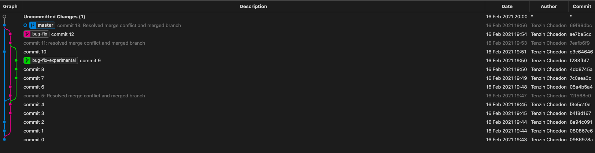

# CSCI 5828 - Spring 2021: Homework 3 -  Git and GitHub

Author:

**Tenzin Choedon**

## Git Graph



Commands Ran:

```
git init
echo "commit 0" > README.md
git add .
git commit -m "commit 0"
git checkout -b bug-fix
git checkout master
vim README.md
git add . && git commit -m "commit 1"
vim README.md
git add . && git commit -m "commit 2"
git checkout bug-fix
vim README.md
vim README.md
git add . && git commit -m "commit 3"
vim README.md
git add . && git commit -m "commit 4"
git checkout -b bug-fix-experimental
git checkout bug-fix
git merge main
git merge master
vim README.md
git add . && git commit -m "commit 5: Resolved merge conflict and merged branch"
git branch
vim README.md
git add . && git commit -m "commit 6"
git checkout bug-fix-experimental
vim README.md
git add . && git commit -m "commit 7"
echo "commit 8" >> README.md &&  git add . && git commit -m "commit 8"
echo "commit 9" >> README.md &&  git add . && git commit -m "commit 9"
git checkout master
echo "commit 10" >> README.md &&  git add . && git commit -m "commit 10"
git checkout bug-fix
git merge bug-fix-experimental
vim README.md
git status
git add .
git commit -m "commit 11: resolved merge conflict and merged branch"
git branch
echo "commit 12" >> README.md &&  git add . && git commit -m "commit 12"
git checkout master
git merge bug-fix
vim README.md
git add .
git commit -m "commit 13: Resolved merge conflict and merged branch"
```
Edits during each commit:
commit 0

commit 1

commit 2
commit 3

commit 4

commit 5

commit 6
commit 7
commit 8
commit 9
commit 10
commit 11
commit 12
